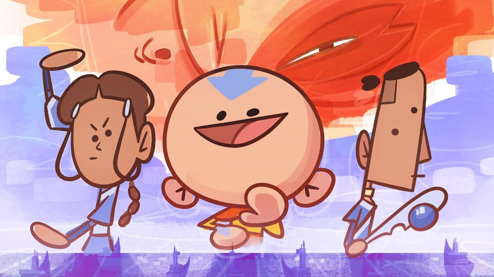

# IF2210 Project Template

> Image taken from [this amazing YouTube video.](https://www.youtube.com/watch?v=nkX9vpsCi3I)

Some classes are written in this class diagram : [here](https://www.draw.io/#G14HlTTgaMnMFkue-jKyBi_Nd2L9VMpUsd)

## Prerequisites
In order to run this program, you must have Java with JDK 8 and its JRE.

## Building
Here is an example of project using gradle as the build tools.
Try running these commands:

`./gradlew run`

You will notice that it will open a window that display 'Avatar Duel'.

## Credit

This project was worked on by **two** people:
* Matthew Kevin Amadeus - 13518035
* Felicia Gojali - 13518101

### Wall of Shame
Huge thanks to my wonderful team that works so, **so** hard on this project.

> Here's how my group chat looks on D-3.

> Such response.
